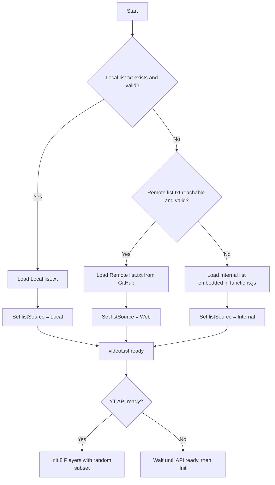

# 🎬 Active Viewer

Ένα web‑based multi‑viewer που εμφανίζει και διαχειρίζεται πολλαπλά YouTube βίντεο ταυτόχρονα, με φυσική συμπεριφορά και πλήρη έλεγχο μέσω UI.

---

## ✨ Χαρακτηριστικά

### 📂 Διαχείριση Λίστας Βίντεο
- **Προεπιλογή** → Φόρτωση `list.txt` από τον ίδιο φάκελο με το `index.html` και `functions.js`.
- **Fallback #1** → Αν αποτύχει, φόρτωση από το remote αρχείο (https://deadmanwalkingto.github.io/ActiveViewer/list.txt)
- **Fallback #2** → Αν αποτύχει κι αυτό, χρήση της εσωτερικής λίστας 15 IDs που είναι ενσωματωμένα στο `functions.js`.
- **Reload List** → Κουμπί που ξαναφορτώνει τη λίστα και εμφανίζει μήνυμα με την πηγή και το πλήθος IDs. Όπως παρακάτω.
🔄 List reloaded — Source: Local (Total IDs = 25)

### 🎬 Διαχείριση Βίντεο
- 8 YouTube players σε grid (4×2 σε desktop, 2×4 σε mobile).
- Responsive layout με media queries.
- Τυχαία καθυστέρηση εκκίνησης (5–180s).
- Τυχαίο αρχικό seek (0–60s).
- Auto‑next → όταν τελειώσει ένα βίντεο, φορτώνεται αυτόματα άλλο από τη λίστα.
- Mid‑seek → κάθε 5–9 λεπτά γίνεται τυχαία μετακίνηση σε νέο σημείο (30–120s).
- Τυχαίες παύσεις:
- Μικρές (2–5s).
- Μεγάλες (15–30s).
- Playback quality ορίζεται σε “small”.

### 🔊 Έλεγχος Ήχου
- **Mute/Unmute All**
- Στο πρώτο click λειτουργεί ως Enable Sound, κάνει `unMute()` και δίνει τυχαία ένταση (10–30%).
- Στο επόμενο click ξανακάνει mute.
- **Randomize Volume All** → τυχαία ένταση (0–100%).
- **Normalize Volume All** → επαναφορά έντασης σε σταθερή τιμή (20%).

### 🖥️ Panel Ελέγχου
- ▶ Play All  
- ⏸ Pause All  
- ⏹ Stop All  
- ⏭ Next All  
- 🎲 Shuffle All  
- 🔁 Restart All  
- 🔇 Mute/Unmute All  
- 🔊 Randomize Volume All  
- 🎚 Normalize Volume All  
- 🌓 Dark/Light Mode Toggle  
- 🧹 Clear Logs (καθαρίζει το activity panel)  
- 🔄 Reload List (ανανεώνει τη λίστα IDs)

### 📊 Activity & Stats Panel
- **Activity panel** → εμφανίζει σε πραγματικό χρόνο όλα τα logs (start, pause, resume, seek, volume changes, auto‑next).
- **Stats panel** → μετρητές για AutoNext, Manual Next, Shuffle, Restart, Pauses, Volume Changes.

Ακολουθεί παράδειγμα logs.

- 🚀 Project start — HTML v1.2.1 | JS v1.3.3
- ✅ Players initialized (8) — Source: Local (Total IDs = 25)
- [12:34:56] Player 3 — ▶ Start after 45s, seek=12s : id=JFweOaiCoj4 
- 🧹 Logs cleared 
- 🔄 List reloaded — Source: Local (Total IDs = 25)

---

## 📂 Δομή Project

- **index.html** → Layout, κουμπιά, panels, σύνδεση με JS  
- **functions.js** → Όλη η λογική του player + τριπλό fallback λίστας + logs + stats  
- **list.txt** → Προεπιλεγμένη λίστα IDs (αν υπάρχει)  
- **README.md** → Περιγραφή χαρακτηριστικών  

---

## 🚀 Χρήση

1. Βάλε το `index.html`, το `functions.js` και (προαιρετικά) το `list.txt` στον ίδιο φάκελο.  
2. Άνοιξε το `index.html` σε browser με σύνδεση στο Internet.  
3. Το YouTube IFrame API φορτώνεται αυτόματα.  
4. Οι players ξεκινούν με τυχαία καθυστέρηση και συμπεριφορά.  
5. Χρησιμοποίησε τα κουμπιά για να ελέγξεις όλους τους players.  

---
---

## 🔁 Flowchart fallback λίστας

### 📌 Σημείωση

- Αν υπάρχει list.txt στον φάκελο → χρησιμοποιείται αυτό.
- Αν λείπει ή είναι άδειο → γίνεται fallback στο remote αρχείο GitHub.
- Αν αποτύχει κι αυτό → χρησιμοποιείται η εσωτερική λίστα IDs.
- Μπορείς να αλλάξεις ή να προσθέσεις IDs απευθείας στο list.txt ή στο internalList του functions.js.
- Το activity panel κρατάει μόνο τα τελευταία 50 logs.

---
---

## 📑 Screen Layout Management

Η εφαρμογή **Active Viewer** προσαρμόζεται δυναμικά σε διαφορετικά μεγέθη οθόνης (desktop, laptop, tablet, mobile). Η διάταξη χωρίζεται σε τρία βασικά τμήματα:

### 1. Controls Panel (πάνω μέρος)
- Πάντα ορατό στην κορυφή (`position: sticky; top:0`).
- Περιέχει όλα τα κουμπιά ελέγχου (Play, Pause, Stop, Next, Shuffle, Restart, Volume, Theme, Logs).

### 2. Main Section (μεσαίο τμήμα)
- Περιλαμβάνει το **Grid με τους 8 players** και το **Activity Panel (log)**.
- **Desktop/Laptop:**
  - Το ύψος μοιράζεται ποσοστιαία:
    - Grid → ~70% του διαθέσιμου χώρου.
    - Activity Panel → ~30% του διαθέσιμου χώρου, με scroll για τα logs.
- **Tablet/Mobile:**
  - Grid με λιγότερες στήλες και auto height:
    - Tablet → 2 στήλες × 4 σειρές.
    - Mobile → 1 στήλη × 8 σειρές.
  - Τα iframes έχουν σταθερό ύψος (220px).
  - Το Activity Panel έχει ύψος ~20% του viewport (`20vh`).

### 3. Stats Panel (κάτω μέρος)
- Πάντα ορατό στο κάτω μέρος της σελίδας.
- Εμφανίζει counters (AutoNext, ManualNext, Shuffle, Restart, Pauses, VolumeChanges).
- Έχει auto height, προσαρμόζεται στο περιεχόμενο.

---

## 📐 Responsive Συμπεριφορά
- **Desktop/Laptop:**  
  - Controls πάνω, Stats κάτω.  
  - Grid και Activity μοιράζονται το υπόλοιπο ύψος με ποσοστά (70% / 30%).  
- **Tablet/Mobile:**  
  - Grid με λιγότερες στήλες και auto height.  
  - Activity Panel με `20vh`.  
  - Stats Panel κάτω, auto height.

---

## ⚠️ Σημεία Προσοχής
- Χρήση `flex` και `min-height:0` για να αποτρέπεται η αύξηση ύψους του `.main` όταν το Activity Panel γεμίζει με logs.
- Το Activity Panel έχει `overflow-y:auto` ώστε να εμφανίζεται scroll αντί να μεγαλώνει.
- Το layout παραμένει σταθερό και ευανάγνωστο σε όλες τις συσκευές.
 
---
---

## Νέα Λογική Λιστών (Main & Alt)

Η εφαρμογή πλέον υποστηρίζει δύο λίστες βίντεο:

- **Main list (list.txt)** → η κύρια λίστα που φορτώνεται με τριπλό fallback (Local → Web → Internal).
- **Alt list (random.txt)** → η δευτερεύουσα λίστα που φορτώνεται από τοπικό αρχείο.

### Κανόνες Χρήσης
- Αν η Alt λίστα έχει **λιγότερα από 10 IDs**, αγνοείται και όλοι οι players τρέχουν από την Main list (log: *Alt list <10 IDs, ignored*).
- Αν η Alt λίστα έχει **10 ή περισσότερα IDs**, οι players μοιράζονται στη μέση:
  - **Players 1–4** → Main list
  - **Players 5–8** → Alt list

### Stats Panel
Το Stats Panel εμπλουτίστηκε ώστε να εμφανίζει:
- Counters (AutoNext, ManualNext, Shuffle, Restart, Pauses, VolumeChanges)
- Τις εκδόσεις HTML και JS
- Τα μεγέθη των λιστών (Main και Alt)

Παράδειγμα:
- 📊 Stats — AutoNext:3 | ManualNext:0 | Shuffle:1 | Restart:0 | Pauses:2 | VolumeChanges:1 — HTML v1.5.8 | JS v2.4.6 | Main:81 | Alt:2042

### Logs
- Κατά την εκκίνηση και την επανεκκίνηση των players εμφανίζεται log με την πηγή κάθε player (Main ή Alt).
- Σε περίπτωση που η Alt λίστα έχει <10 IDs, εμφανίζεται σχετικό μήνυμα στο log.

---
---

## Φυσική Συμπεριφορά Players (Mid-seek & Pauses)

Η λογική των players έχει βελτιωθεί ώστε να προσομοιώνει πιο φυσική θέαση:

### 🔹 Mid-seek (δυναμικό)
- Το mid-seek πλέον εξαρτάται από τη διάρκεια του βίντεο.
- Ορίζεται παράθυρο μετακίνησης στο **20%–60%** της συνολικής διάρκειας.
- Αν δεν υπάρχει διαθέσιμη διάρκεια από το API, χρησιμοποιείται fallback σταθερό παράθυρο (30–120s).
- Τα logs εμφανίζουν και τη συνολική διάρκεια του βίντεο για πλήρη εικόνα.

Παράδειγμα log:
- ⤴ Mid-seek to 240s (duration=600s)

### 🔹 Pauses (προσαρμοσμένες)
- Οι παύσεις πλέον υπολογίζονται ως ποσοστά της διάρκειας:
  - **Small pause** → στο 10–20% της διάρκειας, διάρκεια 2–5% του συνολικού μήκους.
  - **Large pause** → στο 40–60% της διάρκειας, διάρκεια 5–10% του συνολικού μήκους.
- Αν δεν υπάρχει διαθέσιμη διάρκεια, χρησιμοποιείται η παλιά σταθερή λογική (2–5s και 15–30s).
- Τα logs εμφανίζουν τη διάρκεια του βίντεο και το μήκος της παύσης.

Παράδειγμα log:
- ⏸ Small pause 18s (duration=180s)
- ▶ Resume after small pause

### ✅ Οφέλη
- Πιο ρεαλιστική συμπεριφορά σε μικρά και μεγάλα βίντεο.
- Αποφυγή «παράλογων» παύσεων σε πολύ μικρά clips ή υπερβολικά μεγάλα videos.
- Εμπλουτισμένα logs για καλύτερη παρακολούθηση.

---
---

## Modifications v3.1.4
- Προστέθηκαν νέα counters στα stats: Replay, MidSeeks, Watchdog, Errors.
- Οι AutoNext / Error skip ενημερώνουν πλέον τα νέα counters.
- Οι players κλειδώνουν τη λίστα τους στην αρχή (Main, Alt, Internal).
- Οι συναρτήσεις NextAll / ShuffleAll / RestartAll χρησιμοποιούν την κλειδωμένη λίστα ανά player.

---
